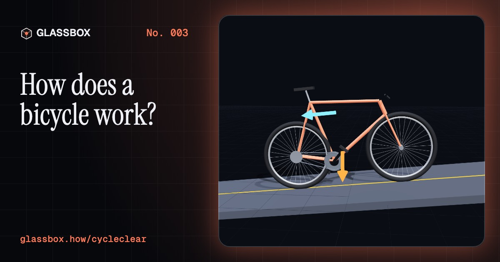
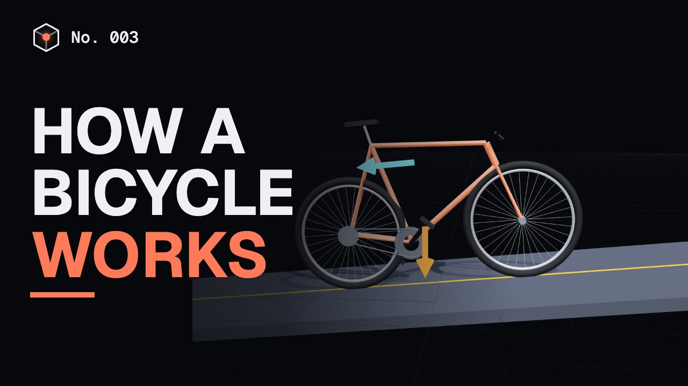
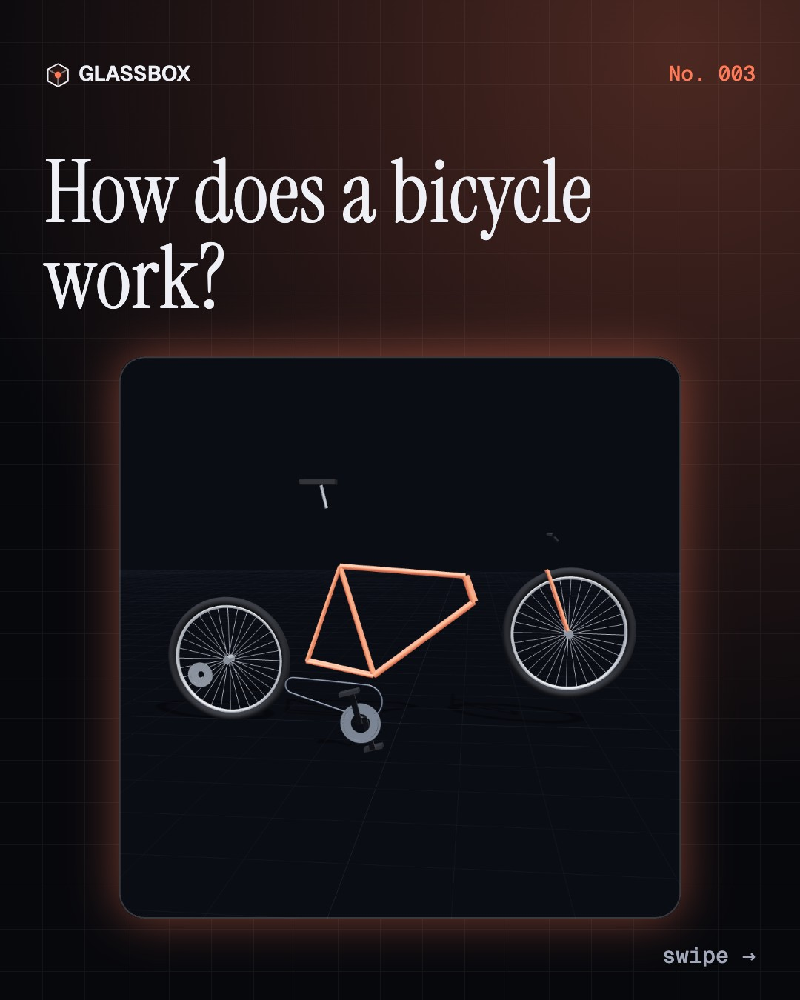
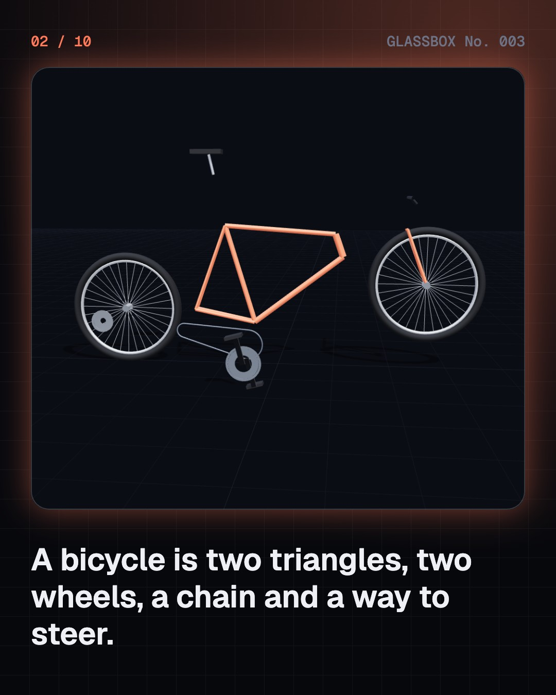
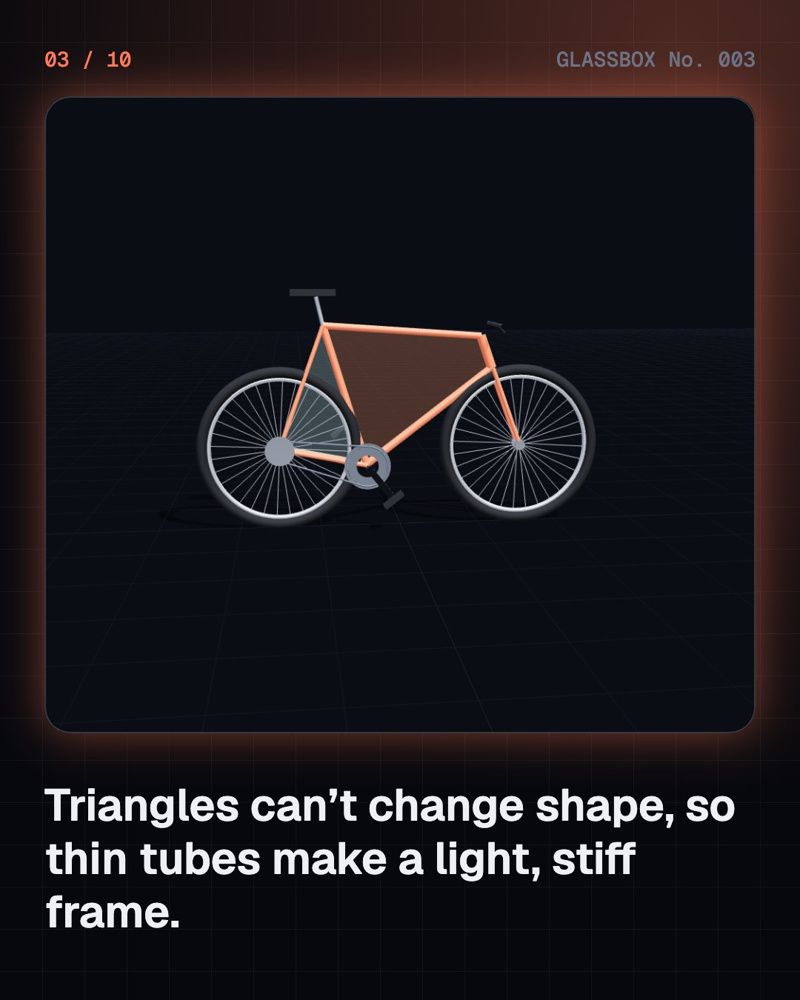
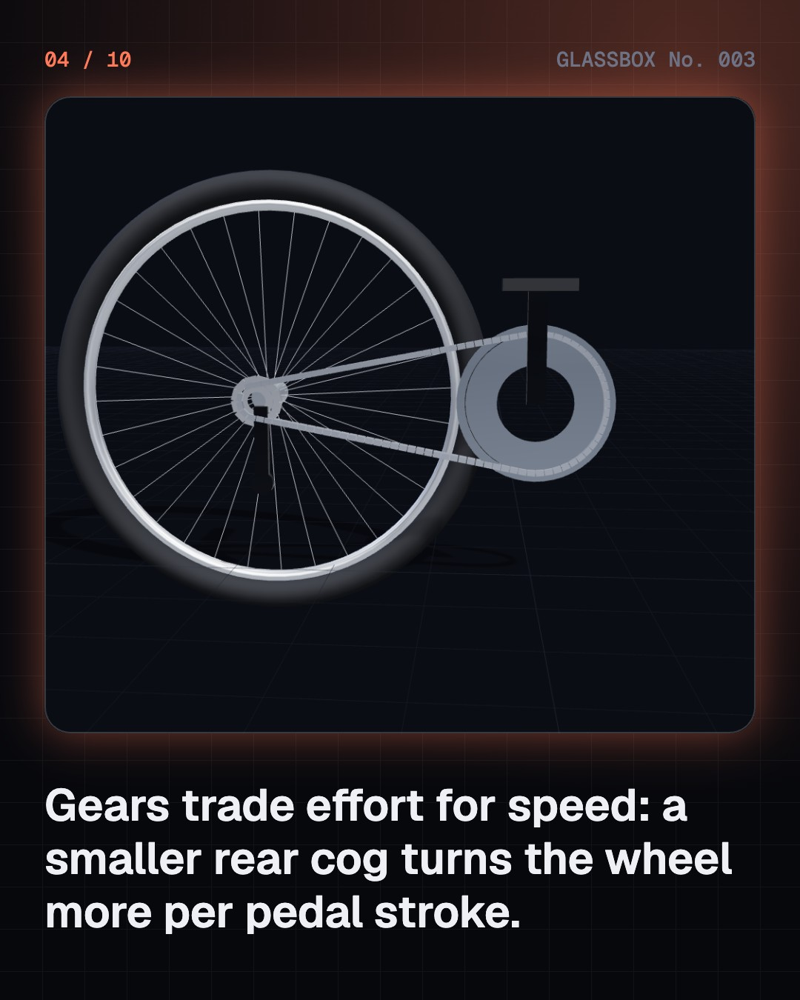

<!-- glassbox:start -->
<!-- Generated from glassbox.json by the Glassbox hub (npm run readme -- cycleclear). Edit glassbox.json, not this block. -->
<p align="center"><a href="https://glassbox-production-fd52.up.railway.app/e/cycleclear/"></a></p>

<h1 align="center">CycleClear</h1>

<p align="center"><b>How does a bicycle work?</b><br>Two triangles, a chain and a wheel of thin wires, and a machine that balances itself. Take a bicycle apart in 3D and ride its physics.</p>

<p align="center"><a href="https://glassbox-production-fd52.up.railway.app/cycleclear/"><b>▶ Play with it</b></a> &nbsp;·&nbsp; <a href="https://glassbox-production-fd52.up.railway.app/e/cycleclear/">Read the 60-second explainer</a> &nbsp;·&nbsp; <a href="https://glassbox-production-fd52.up.railway.app/cycleclear/glassbox/reel.mp4">Watch the 40-second video</a></p>

<p align="center">
  <a href="https://glassbox-production-fd52.up.railway.app/e/cycleclear/"></a>
  <a href="https://glassbox-production-fd52.up.railway.app/e/cycleclear/"></a>
  <a href="LICENSE"></a>
  <a href="LICENSE-CONTENT.md"></a>
  <a href="#privacy"></a>
</p>

## In 60 seconds

1. **A frame of two triangles.** Most bikes use a diamond frame: two triangles sharing the seat tube. A triangle can't change shape unless one side changes length, so thin, light tubes make a stiff frame.
2. **A chain links pedals to wheel.** Your feet turn the cranks and the front chainring. The chain carries every tooth's movement to a small cog on the back wheel, so the wheel turns with you.
3. **Gears trade effort for speed.** The gear ratio is front teeth divided by rear teeth. A small rear cog gives more distance per pedal stroke but needs more force; a big one makes hills easier but slower.
4. **A moving bike balances itself.** When a moving bike leans, its front wheel steers into the lean, bringing the wheels back under it. Above about 15 km/h, many bikes catch every wobble on their own. Lock the handlebars and it falls.
5. **Wheels hang on tensioned spokes.** Every spoke is pulled tight to about 1,000 newtons. When you sit on the bike, only the spokes at the bottom change: they lose some tension. The rest hold the rim round.
6. **Brakes turn motion into heat.** Stopping means getting rid of kinetic energy, which grows with the square of speed. Brake pads grip a disc or rim and friction turns that energy into heat.

## Words worth knowing

| Term | Meaning |
|---|---|
| **Gear ratio** | Front teeth divided by rear teeth: how many times the wheel turns for each turn of the pedals. |
| **Cadence** | How fast you pedal, in revolutions per minute. |
| **Trail** | How far behind the steering axis the front tyre touches the ground. It helps the front wheel steer into a lean. |
| **Self-stability** | A moving bicycle's ability to correct a lean without a rider. |
| **Spoke tension** | The pull built into every spoke, which lets thin wires carry a rider's weight. |
| **Kinetic energy** | The energy of motion, equal to half the mass times the speed squared. |
| **Torque** | A turning force: force multiplied by the length of the lever it pushes on. |

## A short history

**200 years from a wooden running machine to the e-bike.**

- **1817** · The running machine (Karl Drais, Mannheim, Germany)
- **1864** · Pedals on the front wheel (Pierre Michaux, Pierre Lallement and others, Paris, France)
- **1869** · Wheels of tensioned wire (Eugène Meyer, Paris, France)
- **1871** · The high wheeler (James Starley and William Hillman (Ariel), Coventry, England)
- **1880** · The bush roller chain (Hans Renold, Manchester, England)
- **1885** · The safety bicycle (John Kemp Starley (Rover), Coventry, England)
- **1888** · The air-filled tyre (John Boyd Dunlop, Belfast, Ireland)
- **1896** · “Done more to emancipate women” (Susan B. Anthony, New York, USA)

The full story, with 26 moments, charts, people and 28 sources: [glassbox.how/e/cycleclear/history](https://glassbox-production-fd52.up.railway.app/e/cycleclear/history/). The data lives in [`history.json`](history.json).

## Video and slides

Made with the Glassbox studio from this box's storyboard (`window.glassbox.director`). Free to reuse under CC BY 4.0.

<a href="https://glassbox-production-fd52.up.railway.app/cycleclear/glassbox/video.mp4"></a>

<p><a href="glassbox/slide-1.jpg"></a> <a href="glassbox/slide-2.jpg"></a> <a href="glassbox/slide-3.jpg"></a> <a href="glassbox/slide-4.jpg"></a></p>

| File | What | Size |
|---|---|---|
| [`glassbox/reel.mp4`](https://glassbox-production-fd52.up.railway.app/cycleclear/glassbox/reel.mp4) | Reel / Short, with captions and soundtrack | 1080×1920 |
| [`glassbox/video.mp4`](https://glassbox-production-fd52.up.railway.app/cycleclear/glassbox/video.mp4) | YouTube video, with captions and soundtrack | 1920×1080 |
| `glassbox/slide-1…10.jpg` | Instagram carousel | 1080×1350 |
| `glassbox/thumb.jpg` | YouTube thumbnail | 1280×720 |
| `glassbox/cover.jpg` | Share card and repo social preview | 1200×630 |
| [`glassbox/history-reel.mp4`](https://glassbox-production-fd52.up.railway.app/cycleclear/glassbox/history-reel.mp4) | “History in 10 moments” Reel / Short | 1080×1920 |
| `glassbox/history-slide-*.jpg` | History carousel | 1080×1350 |
| `glassbox/post.json` | Post copy and schedule used by the publish kit | |

## Privacy

This box has no accounts and no ads, and it ships its own fonts and libraries. When you run it yourself it sends nothing anywhere. On glassbox.how, the site's `/bar.js` also loads Glassbox's analytics: **Google Analytics** to count visits (it asks first in the EU, UK and Switzerland, and stays off when your browser sends Global Privacy Control or Do Not Track) and **ClickTrust** to detect bots.

It remembers a few things **in your own browser only**, and never sends them anywhere:

| Browser storage key | What it holds |
|---|---|
| `cycleclear.v1` | Which chapters you have opened, your best quiz scores, and sound on or off. |

Exactly what each one sees is at [glassbox.how/privacy](https://glassbox-production-fd52.up.railway.app/privacy/).

## Licences

- **Code:** [MIT](LICENSE). Use it, change it, ship it.
- **Explanations, text, images and videos** (`glassbox.json`, `glassbox/`): [CC BY 4.0](LICENSE-CONTENT.md). Credit “Glassbox, glassbox.how/e/cycleclear”.
- **Third-party parts** keep their own licences: [three.js](https://threejs.org) (MIT), [Geist, Instrument Serif](https://openfontlicense.org) (SIL OFL 1.1).
- The Glassbox name and logo aren't covered by either licence. See the [terms](https://glassbox-production-fd52.up.railway.app/terms/).

Found a mistake? [Open an issue](https://github.com/bdeeps/cycleclear/issues). Corrections happen in public.
<!-- glassbox:end -->

## Run it

It's plain HTML, CSS and JavaScript. No build step and no dependencies. Run locally, it contacts no other website.

```bash
python3 -m http.server 8000
```

Three.js and the fonts ship in `vendor/` and `fonts/`, so it also works offline.

Then open http://localhost:8000.

## How it's built

| File | What |
|---|---|
| `index.html`, `css/app.css` | The page and its styles |
| `js/app.js`, `js/stage.js`, `js/ui.js`, `js/kit.js` | The shared Glassbox 3D engine: chapters, 3D stage, controls, quiz, video director |
| `js/chapters/*.js` | One file per chapter: the 3D model, controls, text, key terms, quiz and video scenes |
| `glassbox.json` | Title, question, explainer beats, key terms, browser storage and credits shown on glassbox.how |
| `reel` in each chapter | The storyboard the Glassbox studio records into short videos |
| `glassbox/` | The published video, slides, thumbnail and post copy |
| `fonts/`, `vendor/three/` | Self-hosted Geist and Instrument Serif (SIL OFL 1.1) and three.js (MIT) |
